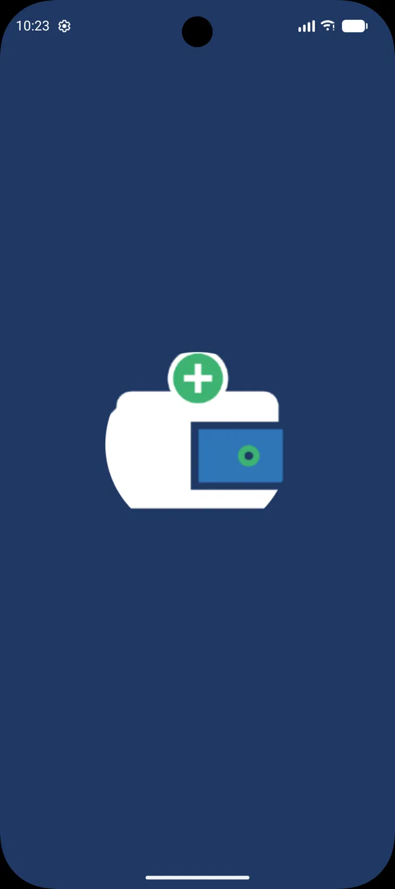
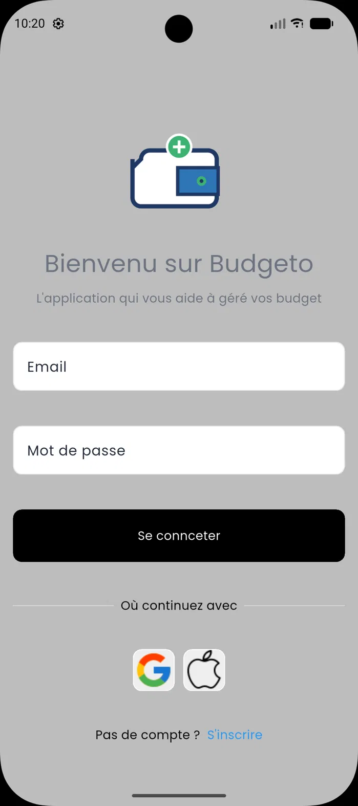
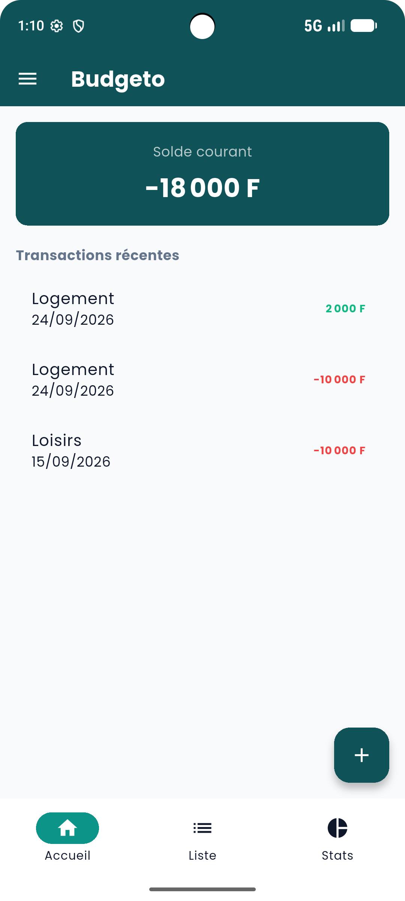
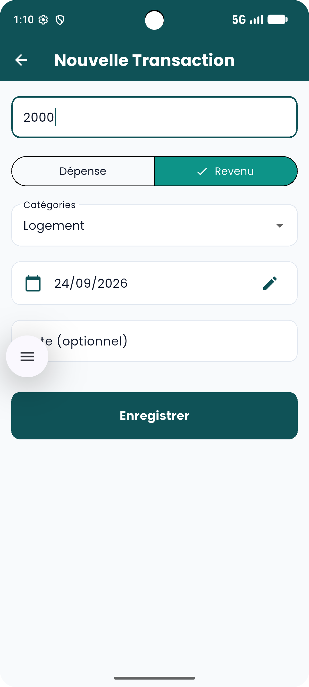
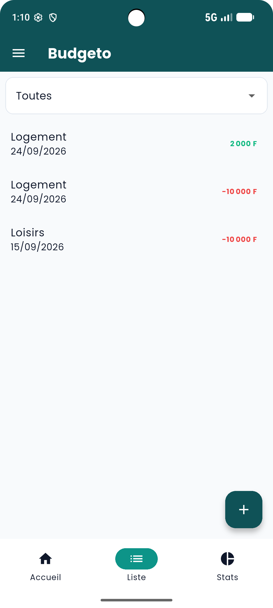
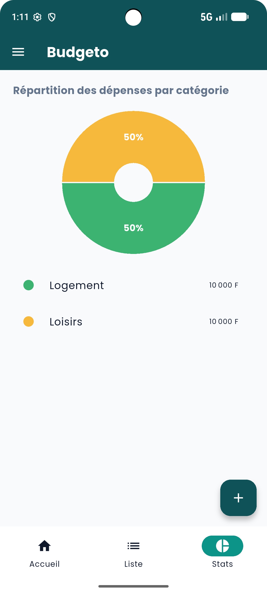

# Budgeto — Application de Suivi de Dépenses Personnelles

Projet individuel réalisé dans le cadre du parcours **DCLIC « Formez-vous au numérique avec l'OIF »
** (Cours de développement mobile approfondi avec Flutter & Dart).

---

## Auteur

- **Auteur** : [Ariel YAMIEN](github.com/yamariel)
- **Formation** : DCLIC — Organisation Internationale de la Francophonie (OIF)

---

## Présentation & Problématique

Beaucoup de personnes gèrent leurs dépenses au quotidien de tête ou sur papier, sans visibilité
claire sur leur solde réel ni sur la répartition de leurs finances. **Mon Budget** répond à ce
besoin en offrant un moyen simple, rapide et mobile d'enregistrer chaque dépense ou revenu et d'
obtenir une vue d'ensemble immédiate de sa situation financière personnelle.

---

## Publics Cibles

- **Particuliers** souhaitant suivre leurs dépenses quotidiennes sans outil complexe.
- **Étudiants & jeunes actifs** gérant un budget limité.
- **Toute personne** disposant d'un smartphone Android et d'une connexion internet.

---

## Fonctionnalités Principales

- **Authentification Sécurisée** : Inscription et connexion par email/mot de passe via Firebase
  Authentication.
- **Gestion des Transactions** : Ajout rapide de transactions (montant, type dépense/revenu,
  catégorie, date, note).
- **Tableau de Bord & Solde** : Affichage dynamique du solde courant (total revenus - total
  dépenses) et des transactions récentes.
- **Historique & Filtres** : Liste des transactions avec filtre par catégorie et suppression par
  glissement (*Dismissible*).
- **Statistiques & Répartition** : Graphique et répartition visuelle des dépenses par catégorie.
- **Interface Moderne & Épurée** : Thème personnalisé vert émeraude & ardoise avec typographie
  *Poppins*.

---

## Captures d'Écran (Aperçu)

|                      Écran de Démarrage                      |                   Connexion & Inscription                   |                    Accueil & Solde                     |
|:------------------------------------------------------------:|:-----------------------------------------------------------:|:------------------------------------------------------:|
|  |  |  |
|                    **Écran de démarrage**                    |                    **Authentification**                     |                  **Tableau de bord**                   |

<br/>

|                    Formulaire d'Ajout                     |                      Historique des Transactions                      |               Statistiques & Graphique               |
|:---------------------------------------------------------:|:---------------------------------------------------------------------:|:----------------------------------------------------:|
|  |  |  |
|                 **Nouvelle Transaction**                  |                        **Liste & Suppression**                        |               **Analyse des Dépenses**               |

---

## Architecture & Choix Techniques

L'application respecte le patron d'architecture **MVC (Models / Views / Controllers)** couplé à des
**Services** pour la gestion de Firebase :

```text
lib/
├── controllers/          
│   ├── auth_controller.dart
│   ├── transaction_controller.dart
│   └── stats_controller.dart
├── models/               
│   ├── app_user.dart
│   ├── category.dart
│   └── transaction.dart
├── services/            
│   ├── auth_service.dart
│   └── firebase_service.dart
├── views/                
│   ├── auth/
│   │   ├── login_screen.dart
│   │   └── register_screen.dart
│   ├── home_screen.dart
│   ├── transaction_form_screen.dart
│   ├── transcation_list_screen.dart
│   └── stats_screen.dart
├── widgets/              
│   ├── my_button.dart
│   ├── my_text_field.dart
│   └── square_title.dart
├── core/                 
│   ├── theme.dart
│   └── buget_colors.dart
├── data/     
│   └── category.dart
├── firebase_options.dart
└── main.dart
```

### Tech Stack & Dépendances

- **Framework** : Flutter / Dart
- **Backend & Base de données** : Firebase Authentication + Cloud Firestore
- **Gestion d'État** : Provider (`ChangeNotifier`)
- **Design & UI** : Material 3, Font Google `Poppins`, Intl

---

## Sécurité & Persistance

- **Règles Cloud Firestore** : Seul l'utilisateur propriétaire connecté peut lire et écrire dans ses
  propres données (`request.auth.uid == userId`).
- **Accès Hors Ligne** : Cache en mémoire et persistance offline de Firestore activés.

---

## Installation & Lancement

1. **Cloner le dépôt** :
   ```bash
   git clone https://github.com/yamariel/mon-budget_dclic.git
   cd mon-budget_dclic
   ```

2. **Installer les dépendances** :
   ```bash
   flutter pub get
   ```

3. **Lancer l'application** :
   ```bash
   flutter run
   ```

---

## Crédits

Projet réalisé dans le cadre de la formation **DCLIC — Organisation Internationale de la
Francophonie (OIF)**.
